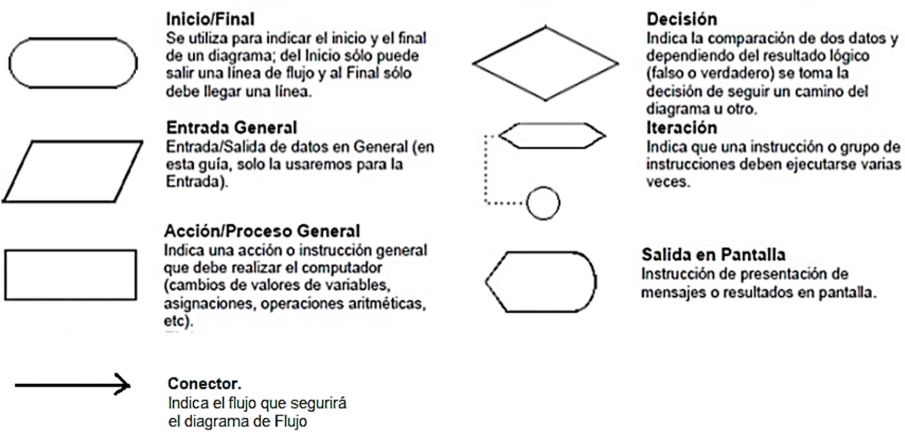

## Algoritmos

Un algoritmo es una secuencia de pasos lógicos necesarios para llevar a cabo unab tarea específica, como la solución de un problema.

Las características fundamentales que debe cumplir todo algoritmo son:

- Debe ser preciso e indicar el orden de realización de cada paso.
- Debe estar definido. Si se sigue un algoritmo dos veces, se debe obtener el mismo resultado cada vez.
- Debe ser finito. Si se sigue un algoritmo, se debe terminar en algún momento; o sea debe tener un número finito de pasos.
- Dentro de un algoritmo se deben encontrar tres partes principales: Entrada, Proceso y Salida.

## Diagrama de flujo

- Un diagrama de flujo es la representación esquemática de un algoritmo.
- Los diagramas de flujo representan la secuencia lógica o los pasos que tenemos que dar para realizar una tarea mediante unos símbolos y dentro de ellos se describen los pasos a realizar.

### ¿Como se debe construir un diagrama de flujo?

- Todos los símbolos han de estar conectador.
- A un símbolo de proceso pueden llegarle varias líneas.
- A un símbolo de decisión pueden llegarle varias líneas, pero sólo saldrán dos (Si o No, Verdadero o Falso).
- A un símbolo de inicio nunca le llegan líneas.
- De un símbolo de fin no parte ninguna línea.

## Símbolos

## Ejercicios
1. Algoritmo para realizar la multiplicación de dos números.
2. Algoritmo para saber si un número es par.
3. Algoritmo para calcular el promedio de un alumno y verifique si pasa o no pasa. Pasa la materia si el promedio es 3 o mas dependiendo de las calificaciones que tuvo en todos los examenes (3).
4. Algoritmo que convierta una cantidad dada en cm a pulgadas, metros y milimetros. Tener en cuenta que:
1 cm -> 0.393701 pulgadas
1 cm -> 0.01 metros
1 cm -> 10 milimetros

