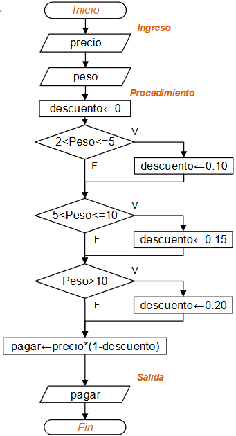

# Tarea 4: Algorimia
Como tarea te propnemos dos ejercicios de algoritmia.

### 1. Programa para calcular descuentos
Una frutería ofrece las manzanas con descuento según la siguiente tabla:

| kilos comprados | Descuento % |
|----------|----------|
| 0 – 2    | 0%   |
| 2.01 – 5    | 10%   |
| 5.01 – 10    | 15 %   |
| 10.01 en adelante    | 20%  |

Dado el precio por kilo, y el peso, Crear un programa usado Javascript que determine cuánto pagará una persona que compre manzanas es esa frutería.


A continuación te presentamos un diagrama de flujo que te puede ayudar a entender mejor el problema


 
### 2. Calcular si un numero es primo (OPCIONAL)

Crear un programa usado Javascript que determine si un número ingresado por el usuario es primo o no.

### Pasos a seguir:

- Solicitar al usuario que ingrese un número.
- Verificar si el número es mayor que 1.
- Utilizar un bucle para comprobar si el número es divisible por algún número entre 2 y la mitad del número.
- Si se encuentra un divisor, el número no es primo; de lo contrario, es primo.
Mostrar el resultado al usuario.

### Pseudo-codigo:
```
1. Leer numero
2. Si numero es mayor que 1:
3.    Para i desde 2 hasta numero/2:
4.        Si numero es divisible por i ( es decir si el modulo de la division entre ambos numeros es igual a cero):
5.            Mostrar "El número no es primo"
6.            Detener el bucle
7.    Si no se encontraron divisores:
8.        Mostrar "El número es primo"
9. Si numero es igual o menor que 1:
10.   Mostrar "El número no es primo"
```

Este algoritmo utiliza un bucle (el bucle "Para") para verificar si el número es divisible por algún número entre 2 y la mitad del número. Si se encuentra algún divisor, el número no es primo; de lo contrario, es primo. Además, utiliza una estructura de control condicional (if) para manejar los casos en los que el número es igual o menor que 1. Finalmente, muestra el resultado al usuario.

### Nota:
Recuerda que para calcular si un numero es divisble por otro debes usar el módulo de la división. 
En JavaScript, el operador de módulo se denota con el símbolo de porcentaje (%). El operador de módulo devuelve el resto de la división entera de dos números.

Por ejemplo:

```javascript
var resultado = 10 % 3;
console.log(resultado); // Output: 1
```
En este ejemplo, 10 es divisible por 3 tres veces, con un resto de 1. Por lo tanto, resultado será 1.

Aquí hay otro ejemplo:

```javascript
var resultado = 10 % 5;
console.log(resultado); // Output: 0
```
En este caso, 16 es divisible por 5 dos veces, con un resto de 0, por lo que resultado será 0.

El operador de módulo es útil para verificar si un número es divisible por otro y para obtener el resto de una división.
